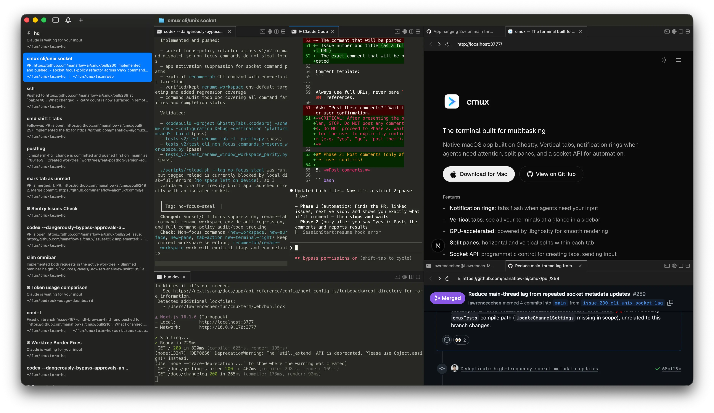

<div align="center">

# cmux-linux

**A GPU-accelerated GTK4 terminal for running AI coding agents in parallel — for Linux.**

Rust + GTK4, powered by [Ghostty](https://github.com/ghostty-org/ghostty)'s rendering engine.
Vertical tabs, splits, workspaces, a browser preview pane, and a socket CLI.



</div>

---

## What this is

A **hardened, Linux-only clean fork** of the cmux Rust/GTK4 port. It tracks the
[tcsenpai/cmux-linux](https://github.com/tcsenpai/cmux-linux) port but strips it
down to what actually builds on Linux and tightens the supply chain. See
[`NOTICE`](NOTICE) for full provenance and credit to upstream
([manaflow-ai/cmux](https://github.com/manaflow-ai/cmux), bradwilson331, tcsenpai).

This is a cleanup/hardening fork, **not** a feature fork.

## Security posture

- **No telemetry, analytics, crash reporting, or auto-update.** The runtime makes
  no outbound network connections of its own.
- **Control surface is a per-user Unix domain socket** (`0600`) under
  `$XDG_RUNTIME_DIR/cmux/`.
- **Submodules are pinned by commit** for reproducible builds. The `ghostty`
  fork's delta over upstream is exactly +44/−6 across two files (a GTK4 embed
  variant + an OpenGL-loader fix), reviewed line by line.
- **No opaque blobs linked in.** The GLAD OpenGL loader is compiled from source
  at build time (`build.rs`), not linked from a committed object file.
- The optional browser-preview pane downloads Google's official
  [Chrome for Testing](https://googlechromelabs.github.io/chrome-for-testing/)
  into a per-user directory, only when you invoke it.

## Building from source

Requires a Rust toolchain, **Zig 0.15.2**, and GTK4 + clang dev libraries.

```sh
git clone --recurse-submodules https://github.com/<you>/cmux-linux.git
cd cmux-linux

# Installs GTK4/clang/libc++ dev deps (apt/dnf/pacman), refreshes the pinned
# submodules, and builds libghostty via zig:
./scripts/setup-linux.sh

# Build the Rust workspace:
cargo build --release
# Binaries: target/release/{cmux-app, cmux, cmux-generate}
```

### Building a `.deb`

```sh
cargo build --release
./packaging/scripts/build-deb.sh
# Output: dist/cmux_<version>_amd64.deb
```

The optional Go `cmuxd-remote` daemon (SSH remote workspaces) is **not** required
for a local build and is omitted when its binary is absent.

## License

[AGPL-3.0-or-later](LICENSE). As a derivative work, this fork stays under the same
license; see [`NOTICE`](NOTICE) for attribution and the list of changes.
